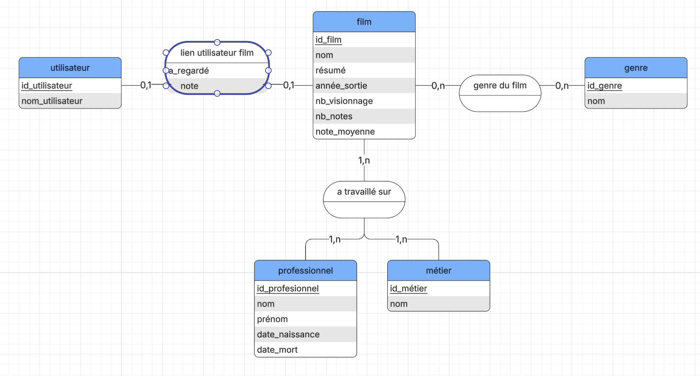

# Lesserboxd
## Introduction
### Decription du projet
Le but est de reproduire le site de notation de films letterboxd.
Notre version aura une liste de films avec les personnes qui ont travaillé dessus, ses genres, l'année de sortie, ainsi que la note moyenne des utilisateurs et d'autres informations sur le film vis à vis des utilisateurs.
Les utilisateurs peuvent se suivre entre eux, dire s'ils ont vu ou aimer un film, le noter et en faire une critique.
### Organisation
Chaque personne dans l'équipe est responsable d'une partie :
- Loïc:  Flask coté serveur
- Louiza: Flask coté front et interaction avec le back-end 
- Ilyass:  Base de donnée (sqlite & python)
Cela, bien sûr, n’empêche pas de travailler ensemble sur certaines parties : l’entraide est une force.

### MCD

